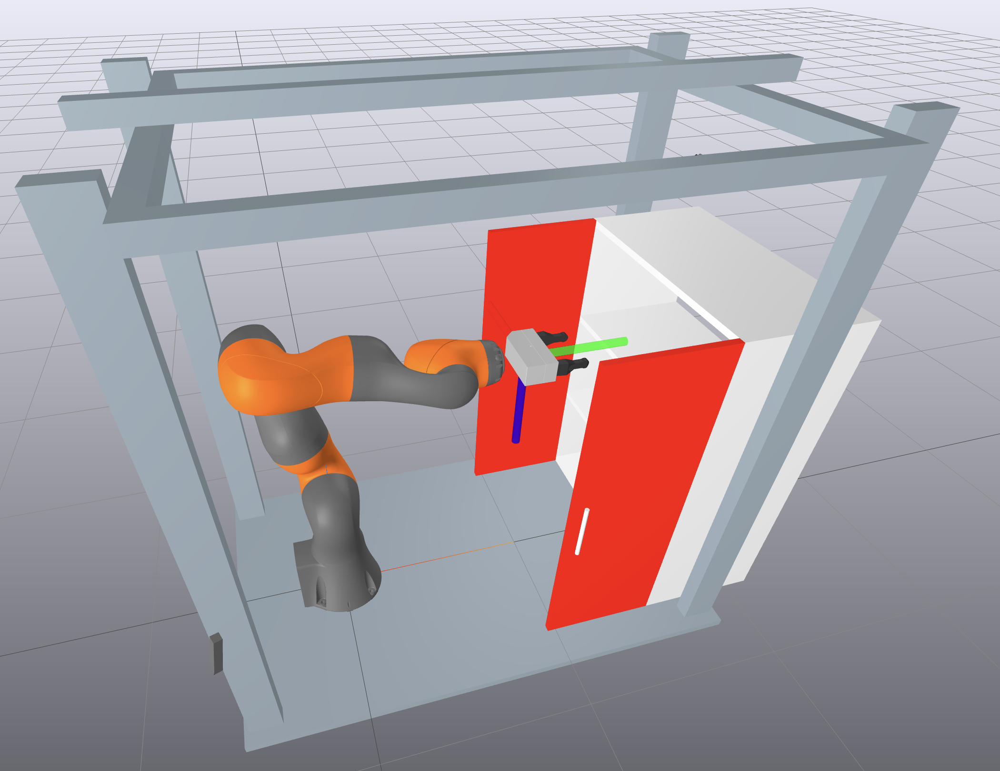

# RRT Motion Planning for the Kuka Iiwa arm in Drake

    

### Starter code for this assignment is adapted from Russ Tedrake's RRT [deepnote exercise](https://deepnote.com/workspace/Manipulation-ac8201a1-470a-4c77-afd0-2cc45bc229ff/project/072-RRT-Motion-Planning-43924ee3-2669-4a96-b23f-57e9a8fda96f/%2Frrt_planning.ipynb) 

### Helpful Reference Material: 
Motion Planning:
[Robotic Manipulation Chap. 7](https://manipulation.csail.mit.edu/trajectories.html)

Solving differential IK as optimization: 
[Robotic Manipulation Chap. 3](https://manipulation.csail.mit.edu/pick.html)
